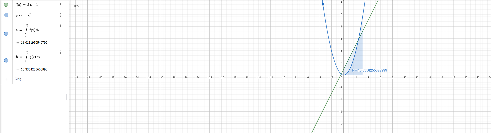

### Integrals of the Functions

The integrals of the following functions over the interval \([0, \pi]\) are:

1. For \( f(x) = 2x + 1 \):
   $$
   a = \int_0^\pi (2x + 1) \, dx \approx 13.0111970546792
   $$

2. For \( g(x) = x^2 \):
   $$
   b = \int_0^\pi x^2 \, dx \approx 10.3354255600999
   $$

